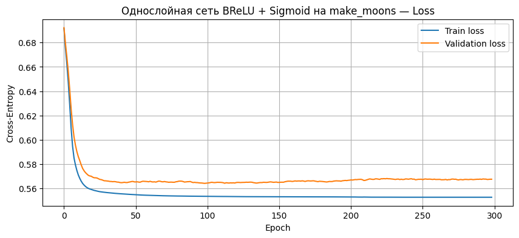
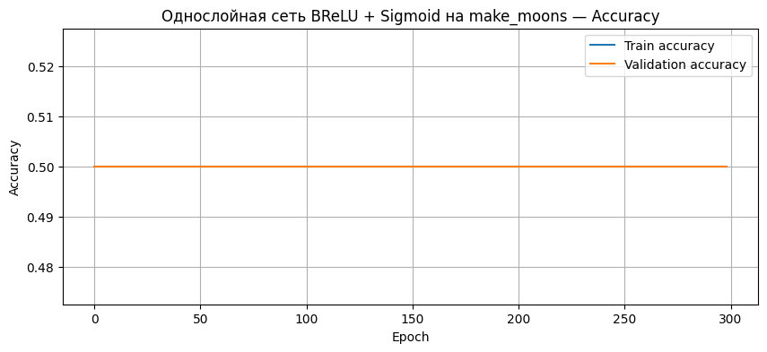
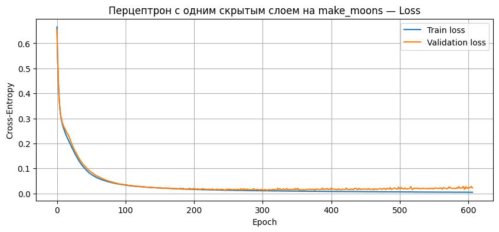
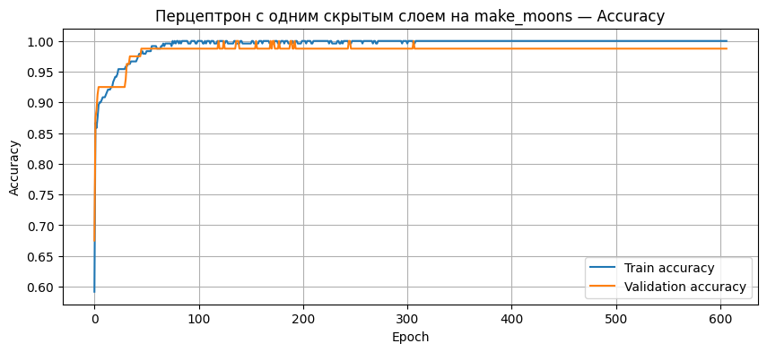
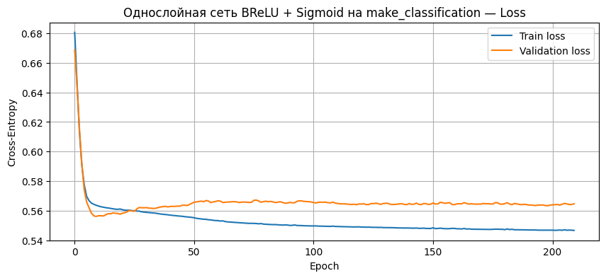
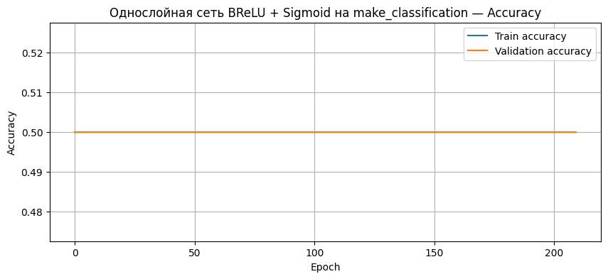
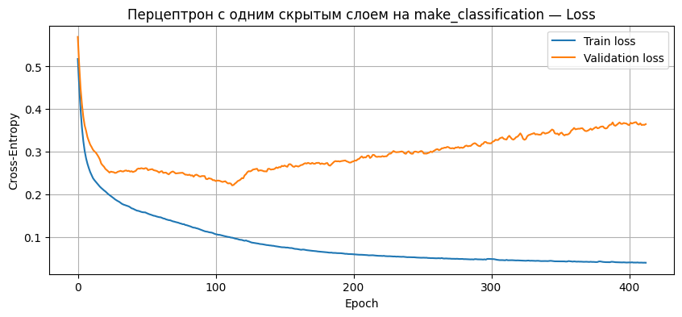
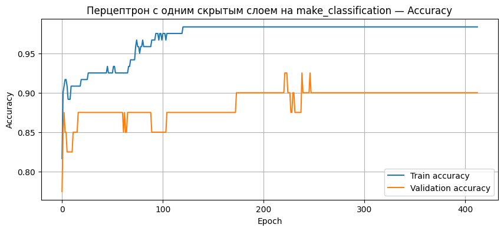

# Лабораторная работа №4  
## Бинарная классификация с использованием BReLU + Sigmoid

## Цель работы

Цель лабораторной работы — реализовать нейронную сеть для бинарной классификации без использования фреймворков глубокого обучения.

В работе были реализованы:

- функция активации `BReLU`;
- выходная функция активации `Sigmoid`;
- функция потерь `Cross-Entropy`;
- стохастический градиентный спуск `SGD` с регулируемым размером батча;
- модифицированный `Adam`, объединяющий идеи `Momentum/Nesterov` и `AdaGrad/RMSProp`;
- однослойная сеть;
- перцептрон с одним скрытым слоем.

---


## Генерация датасетов


Были сгенерированы два датасета.

### Датасет `make_moons`

```python
X, y = make_moons(
    n_samples=400,
    noise=0.15,
    random_state=465572
)
```

Датасет `make_moons` является нелинейно разделимым. Он используется для проверки того, способна ли модель находить сложную разделяющую поверхность.

### Датасет `make_classification`

```python
X, y = make_classification(
    n_samples=200,
    n_features=5,
    n_redundant=2,
    random_state=465572,
    n_informative=2,
    n_clusters_per_class=2,
    n_classes=2
)
```

Датасет `make_classification` содержит 200 объектов и 5 признаков. Из них 2 признака являются информативными, а 2 — избыточными.

---

## Разделение данных

Каждый датасет был разделён на три части:

| Выборка | Доля |
|---|---:|
| Тренировочная | 60% |
| Валидационная | 20% |
| Тестовая | 20% |

Кросс-валидация не использовалась, так как по условию лабораторной работы её реализовывать не требовалось.

После разделения была выполнена стандартизация признаков.  
Параметры стандартизации вычислялись только на тренировочной выборке, после чего применялись к валидационной и тестовой выборкам.

---

## Функция активации BReLU

В работе была реализована функция `BReLU`:

```python
def brelu(z):
    return np.minimum(np.maximum(0, z), 1)
```

Функция ограничивает значения диапазоном от 0 до 1:

```text
BReLU(x) = min(max(0, x), 1)
```

Производная функции использовалась при обратном распространении ошибки:

```python
def brelu_derivative(z):
    return ((z > 0) & (z < 1)).astype(float)
```

---

## Функция активации Sigmoid

Функция `Sigmoid` использовалась на выходе модели для получения вероятности принадлежности объекта к классу 1:

```python
def sigmoid(z):
    z = np.clip(z, -500, 500)
    return 1 / (1 + np.exp(-z))
```

Если значение `Sigmoid` больше или равно `0.5`, объект относился к классу 1.  
Иначе объект относился к классу 0.

---

## Функция потерь Cross-Entropy

Для обучения использовалась бинарная кросс-энтропия:

```python
def binary_cross_entropy(y_true, y_pred):
    eps = 1e-12
    y_pred = np.clip(y_pred, eps, 1 - eps)

    loss = -np.mean(
        y_true * np.log(y_pred) + (1 - y_true) * np.log(1 - y_pred)
    )

    return loss
```

Данная функция подходит для задачи бинарной классификации, так как модель предсказывает вероятность принадлежности объекта к одному из двух классов.

---

## Реализованные оптимизаторы

### SGD

Стохастический градиентный спуск был реализован с регулируемым размером батча:

```python
self.params[key] -= self.lr * grads[key]
```

Размер батча задавался при обучении модели.  
Это позволяет обучать модель не только на всей выборке сразу, но и на отдельных мини-батчах.

### Модифицированный Adam

Также был реализован модифицированный вариант `Adam`, объединяющий идеи:

- `Momentum`;
- `Nesterov`;
- `RMSProp`;
- `AdaGrad`.

В оптимизаторе использовалось накопление первого момента градиента и адаптивное масштабирование шага обучения на основе накопления квадратов градиентов.

---

## Реализованные модели

В работе были реализованы две модели.

### 1. Однослойная сеть BReLU + Sigmoid

Архитектура модели:

```text
Input -> Dense -> BReLU -> Sigmoid -> Output
```

Модель имеет простую структуру и ограниченную способность к построению сложной разделяющей поверхности.

### 2. Перцептрон с одним скрытым слоем

Архитектура модели:

```text
Input -> Dense -> BReLU -> Dense -> Sigmoid -> Output
```

Наличие скрытого слоя позволяет модели лучше работать с нелинейными зависимостями в данных.

---

## Обучение моделей

Обучение проводилось с использованием функции потерь `Cross-Entropy`.

В процессе обучения отслеживались:

- ошибка на тренировочной выборке;
- ошибка на валидационной выборке;
- accuracy на тренировочной выборке;
- accuracy на валидационной выборке.

Для выбора лучшей модели использовалась валидационная ошибка.  
Также применялся `early stopping`, который останавливал обучение при отсутствии улучшения качества на валидационной выборке.

---

# Эксперимент 1. `make_moons`, однослойная BReLU + Sigmoid

## График ошибки



## График accuracy



## Анализ графиков

На графике ошибки видно, что значение `loss` меняется незначительно и не стремится к нулю.  
График accuracy показывает, что качество модели остаётся на уровне `0.5`.

Это означает, что однослойная модель не смогла обучиться для датасета `make_moons`.  
Такой результат связан с нелинейной структурой данных и ограниченной выразительной способностью простой однослойной архитектуры.

По матрице ошибок видно, что модель фактически предсказывала один класс:

```text
[[ 0 40]
 [ 0 40]]
```

Итоговое качество на тестовой выборке:

```text
Test accuracy = 0.500
```

---

# Эксперимент 2. `make_moons`, перцептрон с одним скрытым слоем

## График ошибки



## График accuracy



## Анализ графиков

На графике ошибки видно, что `train_loss` и `val_loss` быстро уменьшаются.  
Это означает, что модель успешно подбирает параметры и снижает ошибку классификации.

График accuracy показывает, что качество на тренировочной и валидационной выборках быстро становится близким к `1.0`.  
Это говорит о том, что перцептрон с одним скрытым слоем хорошо справился с нелинейной структурой датасета `make_moons`.

Матрица ошибок на тестовой выборке:

```text
[[40  0]
 [ 0 40]]
```

Модель не допустила ошибок на тестовой выборке.

Итоговое качество:

```text
Test accuracy = 1.000
```

---

# Эксперимент 3. `make_classification`, однослойная BReLU + Sigmoid

## График ошибки



## График accuracy



## Анализ графиков

На графике ошибки видно, что значение `loss` немного уменьшается, но существенного улучшения не происходит.  
График accuracy показывает, что качество остаётся на уровне `0.5`.

Это означает, что однослойная модель не смогла построить корректную разделяющую поверхность и фактически свелась к предсказанию одного класса.

Матрица ошибок:

```text
[[ 0 20]
 [ 0 20]]
```

Итоговое качество:

```text
Test accuracy = 0.500
```

---

# Эксперимент 4. `make_classification`, перцептрон с одним скрытым слоем

## График ошибки



## График accuracy



## Анализ графиков

На графике ошибки видно, что тренировочная ошибка постепенно уменьшается.  
Валидационная ошибка сначала также снижается, но затем может колебаться или расти. Это говорит о том, что при дальнейшем обучении модель начинает сильнее подстраиваться под тренировочную выборку.

График accuracy показывает, что модель достигает высокого качества на тренировочной и валидационной выборках.  
При этом качество на тестовой выборке также остаётся высоким.

Матрица ошибок:

```text
[[20  0]
 [ 3 17]]
```

Модель правильно классифицировала все объекты класса 0 и допустила 3 ошибки на объектах класса 1.

Итоговое качество:

```text
Test accuracy = 0.925
```

---

## Итоговые результаты

| Датасет | Модель | Test accuracy |
|---|---|---:|
| `make_moons` | Однослойная BReLU + Sigmoid | 0.500 |
| `make_moons` | Перцептрон с одним скрытым слоем | 1.000 |
| `make_classification` | Однослойная BReLU + Sigmoid | 0.500 |
| `make_classification` | Перцептрон с одним скрытым слоем | 0.925 |

---

## Сравнение моделей

Однослойная модель показала низкое качество на обоих датасетах.  
Значение `accuracy = 0.500` соответствует уровню случайного угадывания для задачи бинарной классификации.

Перцептрон с одним скрытым слоем показал значительно лучшие результаты:

- `1.000` на датасете `make_moons`;
- `0.925` на датасете `make_classification`.

Это объясняется тем, что скрытый слой повышает выразительную способность модели и позволяет ей находить более сложные зависимости между признаками.

---

## Вывод

В ходе лабораторной работы была реализована нейронная сеть для бинарной классификации без использования фреймворков глубокого обучения.

Были реализованы:

- `BReLU`;
- `Sigmoid`;
- `Cross-Entropy`;
- `SGD` с регулируемым размером батча;
- модифицированный `Adam`;
- однослойная сеть;
- перцептрон с одним скрытым слоем.

Модели были обучены на двух датасетах: `make_moons` и `make_classification`.  
Данные были разделены на тренировочную, валидационную и тестовую выборки в соотношении 60/20/20.

По результатам экспериментов лучшей моделью оказался перцептрон с одним скрытым слоем.  
Он показал высокое качество классификации на обоих датасетах.

Графики обучения подтверждают, что модель со скрытым слоем действительно обучалась: ошибка уменьшалась, а accuracy увеличивалась.  
Однослойная модель не смогла эффективно разделить классы, что видно по графикам accuracy и матрицам ошибок.

Таким образом, добавление скрытого слоя существенно улучшило качество бинарной классификации.
